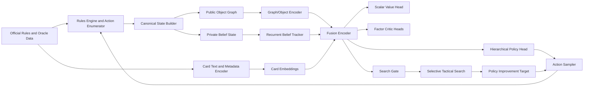
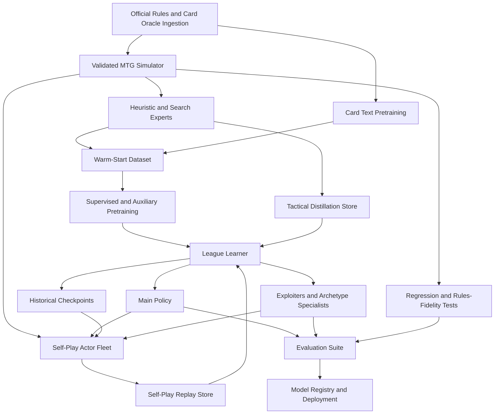

# Designing a General AI for

## Executive summary

A useful operational definition of a **general MTG AI** is not “an agent that solves unrestricted Magic optimally.” That target is the wrong one. Real-world Magic is already governed by a 300+ page living rules document, with explicit machinery for timing and priority, the stack, replacement and prevention effects, continuous-effect layers, multiplayer rules, shortcuts, and illegal actions; meanwhile, formal complexity work shows that real-world Magic admits constructions that make exact optimal play fundamentally intractable as a universal objective. For research and engineering, “general” should instead mean **rules-faithful, card-general, deck-general, hidden-information-aware, and robust across opponent populations within a clearly specified match regime**. citeturn14view0turn15view1turn15view2turn40academia9turn40academia11

The literature points to a **hybrid architecture** as the strongest design for MTG. The core policy should be a **masked recurrent actor-critic** trained in league self-play, but its encoder should not be a plain MLP. It should combine **object/graph structure** over zones and permanents, **sequence memory** over public history, and a **card-text encoder** over Oracle-style rules text so it can generalize to unseen cards. That recommendation is consistent with recent card-game results: PPO-style systems are the most reusable engineering baseline in collectible card games, card-text models such as Cardsformer explicitly improve unseen-card generalization, and recent MTG work already exposes the importance of masked actions, structured observations, and richer credit assignment. citeturn13view0turn17view2turn25view1turn28search11turn33search11

**DeepNash is relevant, but not sufficient.** It is highly relevant because it shows that in a huge, long-horizon, two-player zero-sum imperfect-information game, a no-search, equilibrium-seeking training dynamic can produce very strong play and low exploitability. That makes DeepNash an excellent template for the **self-play objective** and for **robustness against exploitation**. It is not sufficient because MTG’s difficulty is not only strategic equilibrium-finding. MTG also requires **continual interpretation of novel card semantics**, **hierarchical construction of parameterized actions** such as modes, targets, and mana payments, and **local tactical reasoning** around the stack and combat. Stratego’s action semantics are fixed; MTG’s semantics are effectively a continually changing language. My recommendation is therefore to borrow **DeepNash-like regularized self-play principles**, not to deploy a pure DeepNash-style end-to-end system as the entire MTG stack. citeturn19view0turn19view1turn13view0turn33search11turn28search11

Search is still valuable in MTG, but **only selectively**. Recent imperfect-information search work such as ReBeL, Student of Games, GO-MCTS, and LAMIR shows that search can materially help when it operates over the right public or belief abstraction and when the relevant subgame is small enough to search reliably. At the same time, recent CCG analysis argues that in large collectible card games the belief space can become so large that current search methods are unusable if applied naively everywhere. In MTG, that means global search is usually not worth it in early turns with high hidden-state uncertainty and combinatorial branches, but **local tactical search** is often worth it in stack fights, combat, and narrow endgames. citeturn20view1turn18view0turn32view0turn29search0turn27search2

A credible MTG research stack therefore starts with the official urlMagic rules siteturn10search4 and urlGathererturn10search1 as source-of-truth, uses the urlScryfall APIturn10search2 as a pragmatic programmatic ingestion layer, and builds on community execution engines such as urlForgeturn11search0 or urlXMageturn10search3 for R&D. Frameworks such as urlOpenSpielturn7search8 and urlRLCardturn39search2 are excellent for algorithmic baselines and exploitability tooling, but they are not themselves production-grade MTG rules engines. citeturn10search1turn10search2turn10search4turn11search0turn10search3turn7search0turn39search0

## Scope of generality

The term “general MTG AI” should be decomposed into distinct dimensions, because the literature shows that “generality” means different things in different card-game settings. In MTG, the crucial dimensions are **rules generality** (faithfully executing official rules and edge cases), **card generality** (handling previously unseen cards through text and structure), **deck generality** (playing well across unseen archetypes), **opponent generality** (remaining robust across populations rather than overfitting to a single metagame), and **match generality** (handling mulligans, sideboarding, and best-of-three adaptation if those are in scope). Recent MTG deckbuilding work and Cardsformer-style card-text grounding both reinforce that unseen-card generalization is a first-class requirement in collectible card games, not an optional extra. citeturn14view0turn10search1turn33search11turn28search11

The most practical research target is **broad 1v1 generality before multiplayer generality**. The official rules separately expand into multiplayer rules, and recent opponent-modeling work in multiplayer imperfect-information games shows that multiplayer reasoning introduces a qualitatively harder layer of strategic adaptation. That is especially true for Commander-like settings, where politics, table image, and non-zero-sum incentives break many of the clean assumptions behind DeepNash, ReBeL, and most two-player equilibrium methods. A first serious MTG system should therefore aim for **1v1 Constructed gameplay with strong card/deck/rules generality**, then extend to best-of-three sideboarding, and only later attempt multiplayer Commander. citeturn14view0turn22search0turn19view0turn20view1

| Unspecified item | User left unspecified | Working assumption used in this report |
|---|---|---|
| Training compute budget | Unspecified | Assume a research-to-mid-scale cluster is available for the recommended design; I also note cheaper prototype paths. |
| Inference latency target | Unspecified | Assume server-side or offline playtesting use is acceptable; design for fast policy inference with optional tactical search. |
| Proprietary gameplay logs | Unspecified | Assume the system must work **without** proprietary logs; use official card/rules data, public decklists, heuristics, and self-play. |
| Target formats | Unspecified | Assume 1v1 Constructed first; best-of-one initially, then best-of-three with sideboards. |
| Multiplayer support | Unspecified | Exclude multiplayer from the first recommended system. |
| Card-pool breadth | Unspecified | Assume continual updates and unseen-card handling are required; do not assume a frozen historical pool. |
| Allowed community engines | Unspecified | Assume community engines are acceptable for R&D, but official rules/oracle remain the source of truth. |

Under those assumptions, the right benchmark for “general” is not a universal solver over all sanctioned and casual formats. It is a system that can **play legally and strongly across many unseen 1v1 decks and new card releases, with minimal hand-written per-card engineering in the learning stack**, while remaining stable against exploiters and rules drift. That is ambitious, but it is achievable in stages. By contrast, exact unrestricted optimality is a mathematically and operationally misguided target. citeturn40academia9turn40academia11turn33search11turn28search11

## Representation and simulation

MTG’s representation problem begins with the rules. Unlike a single-phase card game with one atomic move per turn, Magic explicitly models **phases and steps, priority passing, a LIFO stack, state-based actions, triggered abilities that are put on the stack when players would receive priority, and many objects that do not use the stack at all**. The recent MTG-Causal-RL benchmark captures only a narrow slice of this broader challenge, and even there the benchmark already uses a 3,077-dimensional partial observation and a 478-action masked discrete space across only five Standard archetypes. That benchmark is useful precisely because it is still much simpler than unconstrained MTG. citeturn15view1turn15view2turn13view0

The state representation should therefore be **object-centric and typed**, not a flat, position-specific vector except in tiny prototype environments. The canonical representation should include at least: public zones as collections of typed objects; private zones as latent or belief-state objects; attachments and counters as relations; stack items as first-class entities; explicit turn/phase/priority markers; and a compact event history for triggers, “until end of turn” effects, and sequencing dependencies. Recent CCG work explicitly argues that permutation-equivariant structure matters because card order in hand or on board is usually semantically irrelevant, and purely slot-based representations waste sample efficiency by forcing the network to relearn the same concept in every position. Emerging graph-based card-game work points in the same direction: relational graphs are a natural inductive bias wherever entities interact through targeting, attachment, control, or effect dependencies. citeturn25view2turn24search0turn24search1

For **card semantics**, the learning stack should ingest the official Oracle-style rules text from urlGathererturn10search1 and structured metadata from the urlScryfall APIturn10search2. The encoder should combine text with structured card fields such as mana cost, colors, types, supertypes, power/toughness, targeting templates, keyword abilities, and card legality metadata. This is not speculative. In MTG deckbuilding, generalized card representations substantially improve transfer to unseen cards, and in Hearthstone, Cardsformer explicitly used card descriptions to train a transition model and a policy that generalized to unseen cards. For MTG, that means the card-text encoder is not a nice-to-have; it is the mechanism by which the agent survives continual new-set releases. citeturn10search1turn10search2turn33search11turn13view1turn28search11

The action representation should be **hierarchical, parameterized, and autoregressive**. MTG actions are rarely atomic. “Cast a spell” usually decomposes into a choice of object, alternate or additional costs, mode, X value, targets, ordering of costs or choices in some corner cases, and sometimes mana-payment plans. Similar decompositions already proved useful in recent Hearthstone work, where authors split decisions into typed source selection and targeting, shrinking the effective categorical branching factor to something manageable and pairing it with validity masks. Invalid-action masking also has theoretical and empirical support in policy-gradient systems and scales much better than simply punishing illegal actions. citeturn17view2turn35search0turn35search9

A practical MTG action space should have at least these top-level branches: **cast/play**, **activate**, **attack subset**, **block assignment**, **special action**, **pass/yield priority**, and **match-level choice** such as mulligan or sideboard selection when in scope. Each branch should produce **candidate-limited subactions** derived from exact rules legality, not from a giant unstructured action catalogue. The MTG-Causal benchmark’s masked discrete formulation is helpful as a research starter, but full MTG needs a richer “action schema + arguments” design. citeturn13view0turn15view1turn15view2

The simulation environment is a make-or-break dependency. Card-game AI history repeatedly shows that progress accelerates only after fast, cloneable, headless simulators exist. The Hearthstone ecosystem benefited from urlSabberStoneturn28search1, competition frameworks, and cloneable search environments; MTG needs the same engineering discipline, but with even stricter fidelity requirements because the rules are broader and the card pool is larger. Community MTG engines are strong starting points, but they are not perfect ground truth: both urlForgeturn11search0 and urlXMageturn10search3 have active issue trackers, which is exactly why a serious MTG AI project needs differential testing and a canonical oracle pipeline. citeturn28search0turn23search0turn11search0turn10search3turn11search8turn10search11

| Environment requirement | What the MTG stack should implement | Why it is non-negotiable |
|---|---|---|
| Rules fidelity | Phases, steps, priority, stack resolution, state-based actions, triggered abilities, replacement/prevention effects, continuous-effect layers, modal choices, target legality, special actions, loops/shortcuts, and illegal-action handling. | These mechanisms are explicit in the official rules and heavily affect tactical correctness. citeturn15view1turn15view2turn14view0 |
| Oracle pipeline | Official Oracle text from Gatherer, with structured programmatic ingestion through Scryfall. | MTG card semantics change through errata and new releases; the model must track the living card language. citeturn10search1turn10search2 |
| Execution system | Deterministic seeding, exact clone/rollback, batched headless simulation, and action enumeration with legality masks. | Self-play throughput and selective tactical search both depend on fast exact branching. citeturn28search0turn35search0turn13view0 |
| Validation | Differential tests against Forge and XMage, plus curated regression suites for known corner cases. | Community engines are valuable but still exhibit public card/rules bugs. citeturn11search8turn10search11 |
| Research baselines | Connectors to OpenSpiel and RLCard-style interfaces where possible. | Reuse exploitability tooling, league evaluation, and algorithm baselines from broader imperfect-information game research. citeturn7search0turn39search0 |

## Architecture comparison

The most relevant recent evidence comes from imperfect-information systems in entity["other","Stratego","board game"], entity["video_game","Hearthstone","digital collectible card game"], entity["other","DouDizhu","Chinese climbing card game"], entity["other","Texas hold'em poker","poker variant"], and smaller research CCGs such as entity["other","Legends of Code and Magic","collectible card game benchmark"]. Those domains do not transfer perfectly to MTG, but together they reveal the core pattern: **the best systems either combine strong learned policies with game-theoretic self-play, or they mix learning with selective search over carefully chosen abstractions**. Purely monolithic choices are usually either too brittle or too inefficient. citeturn19view0turn20view1turn18view0turn17view1turn17view2turn27search1

| Architecture | What the literature shows | Fit for general MTG | Search role | Bottom line |
|---|---|---|---|---|
| **DeepNash-style no-search equilibrium RL** | DeepNash reached expert-level Stratego play without test-time search and used Regularised Nash Dynamics to approach an approximate Nash equilibrium with strong robustness to exploitation. citeturn19view0turn19view1 | Strong match for **long-horizon, hidden-information, 2p0s robustness**; weak match for **continual new-card semantics** and **parameterized action generation**. MTG’s core challenge is not only equilibrium-finding. citeturn19view0turn15view1turn33search11turn28search11 | Not required by design. | **Use as a training principle, not as the whole MTG system.** |
| **Policy-gradient actor-critic, especially PPO/A3C-style** | PPO remains a robust engineering workhorse; recent CCG agents in LOCM, Hearthstone, and MTG-Causal rely on actor-critic-style learning, masked actions, and self-play. A3C-style parallel actor-learners remain a valid systems pattern for throughput and stability. citeturn34search1turn34search0turn25view1turn17view2turn13view0 | Very good fit for MTG because stochastic policies, recurrent hidden state, action masking, and hierarchical policy heads integrate naturally. Sample efficiency is the main weakness. citeturn25view2turn35search0 | Optional; best as a selective add-on. | **Best default optimizer family for the policy core.** |
| **Value-based DQN variants** | NFSP used DQN originally, but later work explicitly argued that DQN-based best-response learning is hard to stabilize in changing online games; MC-NFSP added search to address scale and depth issues. citeturn21search0turn21search8 | Weak default fit. Huge masked/parameterized MTG actions make flat Q-learning awkward unless the environment is aggressively abstracted. | Often needs abstraction or search to remain competitive. | **Not the default recommendation for MTG gameplay.** |
| **Model-based RL and belief/public-state search** | ReBeL and Student of Games show that search plus self-play plus game-theoretic reasoning can be sound and strong in imperfect-information games; newer work such as LAMIR and GO-MCTS shows learned-model planning can help when the right abstraction is found. citeturn20view1turn18view0turn29search0turn32view0 | Very promising for **local MTG tactics** and for reduced public-state subgames; hard as a full-game global strategy because MTG beliefs and action semantics explode. | Valuable locally, dangerous globally. | **Use selectively for stack/combat/endgames.** |
| **Transformers and sequence models** | Cardsformer uses card descriptions to generalize to unseen cards; recent MTG work on generalized card representations improves generalization to unseen cards; GO-MCTS and DTCard show sequence models can support planning or policy learning in card domains. citeturn28search11turn33search11turn32view0turn31search0 | Excellent fit for **card text grounding**, action-history memory, and belief updates; weaker if used alone without object relations or legality-aware action heads. | Optional, often beneficial when paired with search or structured heads. | **Essential inside the encoder, but not sufficient alone.** |
| **Graph neural nets** | Recent card-game work such as GNNetic uses relational graph convolutions to capture card relationships and game context; separate CCG work argues for permutation-equivariant structure to improve sample efficiency. citeturn24search0turn25view2 | Strong inductive bias for battlefield relations, attachments, counters, the stack, and targeting graphs. Less mature as a standalone planner. | Optional. | **Best used as part of a hybrid encoder.** |
| **Hybrid actor-critic + text + graph + league self-play + selective search** | This combines the main lessons of DeepNash, ReBeL, Student of Games, DouZero/DouZero+, Cardsformer, and recent MTG benchmarking. citeturn19view0turn20view1turn18view0turn17view1turn21search2turn28search11turn13view0 | Best overall fit for MTG’s blend of hidden information, card language, tactical local search, and rapid rules/card turnover. | Selective only. | **Recommended architecture.** |

The strongest single conclusion from that comparison is that **DeepNash is appropriate for MTG only in a qualified sense**. If the target were a fixed, two-player, zero-sum MTG microformat with no desire for local search and a premium on robustness under hidden information, DeepNash-like training could be a very strong choice. But for **truly general 1v1 MTG**, the agent must continuously absorb new Oracle card text and produce complex parameterized actions under legality constraints. That shifts the design center of gravity away from “pure no-search equilibrium learner” and toward a **hybrid encoder + masked hierarchical policy + optional tactical search**, with DeepNash-like regularization used to stabilize league self-play and reduce exploitability. citeturn19view0turn19view1turn33search11turn28search11turn15view1turn35search0

Search should therefore be **gated by state type**, not always on and not always off.

| Situation in MTG | Should the system search? | Why |
|---|---|---|
| Early-game openers with many hidden cards and many legal lines | Usually **no**. | The hidden-state tree is too large and the value of global search under deep uncertainty is poor; current CCG search methods become unusable when the belief space cannot be enumerated tractably. citeturn27search2turn19view1 |
| Stack fights with a small legal reply set | Usually **yes**. | These are narrow tactical public subgames where exact cloning and local lookahead can pay off. ReBeL, Student of Games, LAMIR, and GO-MCTS all support the value of search when the abstraction is right. citeturn20view1turn18view0turn29search0turn32view0 |
| Combat with pruned attacker/blocker subsets | Often **yes, shallowly**. | Old MTG search work and more recent card-game planning results both suggest that decomposing subset decisions can make local search useful. citeturn37view0turn32view0 |
| Routine curve-out or obvious sequencing turns | Usually **no**. | Throughput matters more than marginal tactical precision; learned policy should handle these cheaply. citeturn25view2turn17view1 |
| Endgames with few hidden cards and near-forced lines | Often **yes**. | Search becomes more reliable as uncertainty and branch factor collapse. citeturn20view1turn18view0 |

## Recommended architecture and training pipeline

My recommended system is a **hybrid, rules-faithful, league-trained MTG agent** with four core pieces: **an exact simulator**, **a structured encoder**, **a hierarchical masked policy/value module**, and **a selective tactical search layer**. The encoder should mix object-centric and graph-based representations for game objects, a transformer-style card-text encoder for Oracle text, and recurrent memory for public history and posterior beliefs over hidden state. The policy should generate actions autoregressively over action schemas and arguments, while the value side should include both a scalar win-probability head and decomposed auxiliary critic heads for auditability and credit assignment. This design is a synthesis of the most transferable lessons from DeepNash, ReBeL, Student of Games, DouZero+, recent CCG actor-critic systems, Cardsformer, and the MTG-Causal benchmark. citeturn19view0turn20view1turn18view0turn21search2turn17view2turn28search11turn13view0

The reward design should be conservative. The **primary training signal should remain terminal win/loss**, because collectible card game studies already show that naive reward shaping can degrade performance even when it sounds strategically plausible. Dense signals are still useful, but they should mainly appear as **auxiliary critic targets or diagnostic heads** rather than as brittle hand-tuned substitutes for winning. The recent MTG-Causal benchmark is especially useful here: it argues for explicit factor-based, auditable credit assignment rather than relying on scalar win rate alone. In MTG, the most useful auxiliary factors are likely **mana efficiency, board pressure, card advantage, life-buffer/race state, and stack-tempo swing**. citeturn25view2turn13view0

Opponent modeling should be present, but it should be **layered on top of a robust base policy rather than replacing it**. DouZero+ improved over DouZero by adding opponent modeling and coach-guided learning; Hearthstone search systems also benefited from using deck knowledge or opponent prediction; and recent imperfect-information research makes the broader point that robust adaptation and exploitative adaptation should be separated carefully. For MTG, that means keeping a stable “population-robust” base model while learning a fast online opponent embedding for mulligan behavior, revealed cards, sequencing tendencies, and archetype inference. In repeated-play settings, this online layer can adapt. In one-shot ladder settings, it should remain modest to avoid overfitting to noisy early observations. citeturn21search2turn36view1turn22search1turn29search3

The multi-agent training regime should be a **league**, not plain mirror self-play. The league should include: the current main agent; historical checkpoints for mixture-play robustness; fixed archetype specialists; exploiters trained to find weaknesses; and optionally a search-distilled tactical expert for narrow local subgames. This is where the most useful DeepNash idea lives: not “never search,” but rather “train under a dynamic that resists cycling and reduces exploitability.” Optimistic smooth fictitious-play results in research CCGs, R-NaD in Stratego, and broader curriculum/population work like MAESTRO all point in the same direction: one-policy self-play is too brittle for large adversarial domains. citeturn27search1turn19view0turn30search0

The starting hyperparameter ranges below are **recommendations, not direct literature transcriptions**. They are informed by recent PPO-style card-game agents, action-masking work, and self-play/search systems, then adapted to MTG’s much harder rules and higher simulation cost. citeturn34search1turn25view1turn35search0turn17view2

| Component | Recommended starting range | Rationale |
|---|---|---|
| Main policy optimizer | PPO or PPO-like clipped actor-critic; optionally V-trace style off-policy correction in distributed training | PPO-style training is the most practical default for masked, stochastic, structured card-game policies. |
| Discount factor γ | **0.997–0.9995** | MTG has long horizons and delayed terminal credit. |
| GAE / trace parameter λ | **0.95–0.99** | Helps variance reduction without giving up long-horizon signal. |
| PPO clip ε | **0.10–0.20** | Lower clips help policy stability in non-stationary self-play. |
| Entropy coefficient | **1e-4–5e-3**, decayed over training | Needed early for exploration; lower later for precise sequencing. |
| Learning rate | **1e-5–3e-4**, usually cosine or step decay | Distributed actor-critic in games often benefits from careful LR annealing. |
| Rollout length | **64–512 decision points** | Longer rollouts help credit assignment but increase staleness. |
| Batch size per optimizer step | **8k–64k decisions** | The expensive simulator makes larger, more stable batches attractive. |
| Gradient clip norm | **0.5–1.0** | Helps in non-stationary multi-agent training. |
| RNN / history length | **32–256 public events** | Enough to support trigger windows, prior responses, and archetype inference. |
| Text encoder size | **20M–100M parameters** for a domain model | Small enough for practical inference, large enough for card-language transfer. |
| Main fusion encoder size | **50M–250M parameters** | MTG needs more capacity than toy CCGs, but latency still matters. |
| League size | **32–512 active/frozen policies** | Supports robustness, exploiters, and historical mixtures. |
| Search trigger threshold | Invoke search only when legal candidate count and uncertainty are both low enough | Search should be state-dependent, not ubiquitous. |
| Tactical search budget | **32–256 simulations** or **50–500 ms** on gated states | Local tactics can repay shallow search; global search usually cannot. |

The data-generation strategy should have four layers. First, ingest **official card text and rules data** into a consistent card-semantic store. Second, warm-start the model with **legality prediction, action-schema imitation, and optional heuristic or search-expert traces** so the policy does not spend early training rediscovering basic play mechanics. Third, run **large-scale league self-play** over a curated metagame population, including deck diversity and opponent mixtures. Fourth, collect **search-distilled tactical datasets** from stack/combat subgames and use them as auxiliary policy-improvement targets. If proprietary human logs are allowed, they are useful for warm-starting card evaluation and sideboarding priors; if not, the system is still viable through self-play plus public decklists and search-generated traces. citeturn10search1turn10search2turn28search11turn33search11turn20view1turn18view0

Simulation fidelity should be treated as a **first-class ML variable**, not merely an implementation detail. A rules bug is a data bug. Nightly regression should include card-interaction suites for triggers, continuous-effect layers, replacement/prevention effects, copied spells or permanents, unusual targeting, loops, and interrupt-style stack sequences. Any engine change that alters the action set or state transitions should invalidate cached data and trigger replay hygiene checks. In MTG, simulator correctness and learning correctness are tightly coupled. citeturn14view0turn15view1turn15view2turn11search8turn10search11

## Compute, data, and evaluation

The literature does not yet provide a canonical compute recipe for full general MTG. The most honest way to plan is to treat compute and data budgets as **engineering estimates extrapolated from adjacent card-game systems**: desktop-scale PPO in smaller CCGs, four-GPU DouZero-style self-play, very large but less fully disclosed deep self-play systems such as DeepNash, and the currently small MTG-Causal benchmark. The table below should therefore be read as **order-of-magnitude planning guidance**, not as published MTG facts. citeturn26view0turn17view1turn17view0turn19view1turn13view0

| Target capability | Scope | Approximate self-play scale | Hardware estimate | Main trade-off |
|---|---|---|---|---|
| **Benchmark prototype** | Something close to MTG-Causal-RL: a few archetypes, masked discrete actions, no true card-generality | **10M–100M decisions** | **1–4 GPUs**, **32–128 CPU cores** for simulator workers | Fastest path to publishable algorithm work, but nowhere near full general MTG. Basis: MTG-Causal’s restricted scope plus desktop-scale CCG PPO literature. citeturn13view0turn26view0 |
| **Format-constrained competitive agent** | 1v1 Constructed, dozens of archetypes, unseen deck transfer, selective tactical search | **100M–1B decisions** | **8–32 GPUs**, **256–1,024 CPU cores** | Real strength becomes possible, but simulator throughput and league management dominate engineering cost. Basis: DouZero’s four-GPU scale, stronger CCG systems, and the known sample-efficiency gap in card games. citeturn17view1turn17view0turn26view2 |
| **Broad card-general agent** | Continual new-set adaptation, much broader card pool, stronger belief modeling, search distillation, ongoing league training | **1B–10B+ decisions** over continual training | **32–128 GPUs**, large CPU actor fleet, persistent evaluation cluster | This is the first tier that begins to resemble “general MTG,” but it is a sustained platform effort, not a single training run. Basis: extrapolation from DeepNash-scale self-play philosophy, not a published MTG number. citeturn19view1turn26view2 |

Data requirements track the same stages. The one piece of data that is absolutely mandatory is **official card and rules data**. Human gameplay logs are useful but optional. Public metagame decklists are highly valuable. Search-generated tactical traces are especially efficient because they target the few states where local lookahead adds value. The literature also suggests that **representation quality matters as much as raw data quantity**: generalized card embeddings and permutation-aware encoders can improve generalization even before raw training scale reaches the frontier. citeturn10search1turn10search2turn33search11turn25view2

Evaluation must go far beyond scalar win rate. Recent work in both general game frameworks and the MTG-Causal benchmark emphasizes that strong reporting requires **paired seeds, statistical intervals, and multiple orthogonal metrics**. MTG especially needs this because a policy can look strong in mirror self-play and still be highly exploitable or brittle under deck shift. The right evaluation suite should therefore combine **strength**, **robustness**, **generalization**, **calibration**, **legality**, and **systems metrics**. citeturn13view0turn7search0

| Metric family | What to measure | Why it matters in MTG |
|---|---|---|
| **Strength** | Elo or win rate against fixed baselines, historical checkpoints, search-heavy tactical bots, and human/heuristic proxies where available | Raw performance still matters, but only as one dimension. citeturn13view0turn23search0turn23search1 |
| **Matchup robustness** | Full archetype-by-archetype matrix, not only aggregate win rate | MTG is a metagame of matchup distributions. Aggregate win rate can hide severe weaknesses. citeturn13view0turn27search2 |
| **Generalization** | Leave-one-archetype-out, unseen-deck, unseen-card, and new-set transfer | This is the real test of “general” in a collectible card game. citeturn13view0turn33search11turn28search11 |
| **Exploitability proxy** | Restricted best responses, reduced-format NashConv/exploitability where tractable, and exploiter-league performance | ByteRL-style results show that high strength can coexist with high exploitability. citeturn27search2turn7search0 |
| **Belief calibration** | Accuracy and calibration of hidden-hand/deck posteriors under observation | Hidden-information quality is a core MTG skill, not a side metric. citeturn21search2turn22search0 |
| **Legality and fidelity** | Illegal-action rate, desync rate, regression-failure count against rules suites | A strong but illegal MTG policy is not deployable. citeturn14view0turn11search8turn10search11 |
| **Latency and throughput** | Median and tail decision time; simulator decisions per second | Search and deployment are gated by systems constraints. citeturn17view1turn20view1 |
| **Auditability** | Factor-critic calibration, causal or counterfactual diagnostics, ablations over search and opponent modeling | MTG-Causal is useful precisely because scalar win rate misses important structure. citeturn13view0 |

The current benchmark landscape shows both progress and a gap. MTG now has an explicit open benchmark in MTG-Causal-RL, but it is still small compared with the full game. Smaller CCG benchmarks and competitions—Hearthstone AI, LOCM, and Tales of Tribute—remain useful for method development because they let researchers iterate faster on self-play, search, and opponent modeling. Meanwhile, urlOpenSpielturn7search8 and urlRLCardturn39search2 remain the best general-purpose infrastructures for exploitability tooling and baseline algorithms. The right evaluation program for MTG should combine **MTG-specific suites** with **cross-domain sanity checks** on standard imperfect-information games. citeturn13view0turn23search0turn23search1turn23search2turn7search0turn39search0

## Robustness and deployment

For MTG, “safety” mostly means **legality, robustness, and resistance to degenerate failure modes** rather than conventional content safety. The most important failure classes are illegal actions, rules-engine exploitation, overfitting to narrow opponent pools, pathological loops or trigger handling, and silent performance collapse after rules or card-set updates. The literature already gives warning signs: invalid-action masking is essential in large legal-action spaces; collectible card game agents can be highly exploitable even after strong win-rate results; and recent opponent-model research argues that naive adaptation need not even be consistent in the limit. A production-grade MTG AI must therefore ship with strong legality guards, population-robust base policies, online/offline exploit tests, and continual regression against evolving rules/oracle data. citeturn35search0turn35search9turn27search2turn29search3turn14view0

The safest deployment path is usually **offline playtesting or server-side sparring**, not unrestricted public ladder automation. Offline playtesting tolerates higher latency and permits selective tactical search on the stack and in combat, which is ideal for design and balance workflows. A public-facing bot, by contrast, must satisfy strict latency targets, operate under evolving rules, and avoid unhealthy interactions with live ecosystems. If the latency budget is tight, keep the main policy entirely neural and trigger search only on very small tactical subgames. If the latency budget is generous and the use case is internal evaluation, allow a higher search budget and richer opponent adaptation. Either way, keep the base policy deterministic-enough for reproducibility, expose confidence and belief diagnostics in logs, and maintain explicit engine/version pinning. citeturn20view1turn18view0turn29search0turn32view0

The recommended end state is therefore clear. Build **a rules-faithful MTG platform first**, then train **a hybrid masked actor-critic with card-text grounding, object/graph structure, recurrent belief tracking, league self-play, and selective tactical search**. Use **DeepNash-style regularized self-play as a robustness ingredient**, not as the sole system design. Avoid pure DQN-style approaches for full MTG gameplay. Use search only where the subgame is tactically narrow and the simulator is exact. Evaluate everything against matchup robustness, exploitability proxies, unseen-card/deck transfer, legality, and latency—not just headline win rate. That combination is the most rigorous, literature-aligned path toward a genuinely general 1v1 MTG AI. citeturn19view0turn20view1turn18view0turn35search0turn27search2turn33search11turn13view0